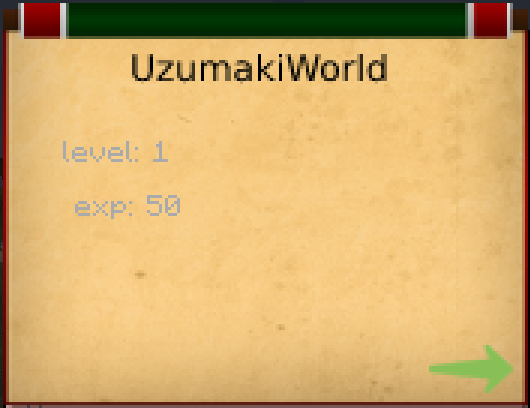
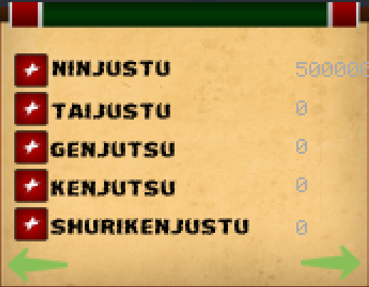
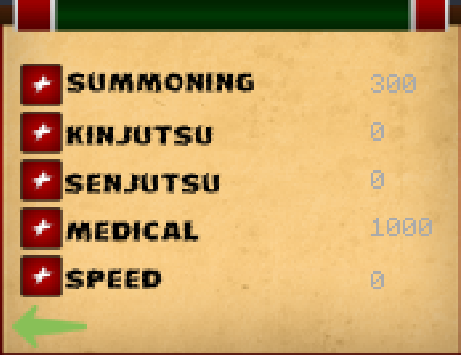
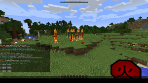
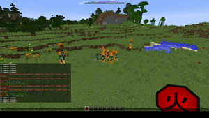
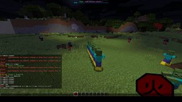
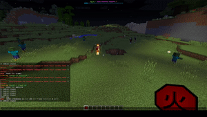

# NarutoPlugin

Minecraft plugin inspired by Naruto-themed abilities, custom items, and combat mechanics.

## Preview
### Menu

### Abilities

## Stack
- Java
- Spigot/Paper plugin structure
- Resource-driven plugin setup

## Features
- Element-based abilities
- Custom items and chakra mechanics
- Animated combat skills and effects
- Visual media in `gifs/` and `photos/`

## Dependencies
- Citizens
- Sentinel
- WorldGuard
- Local libraries from `libs/`

## Notes Before Publishing
- Good showcase project because the repository already contains visual demonstrations.
- It would benefit from a proper build file and a cleaner public setup guide later.
